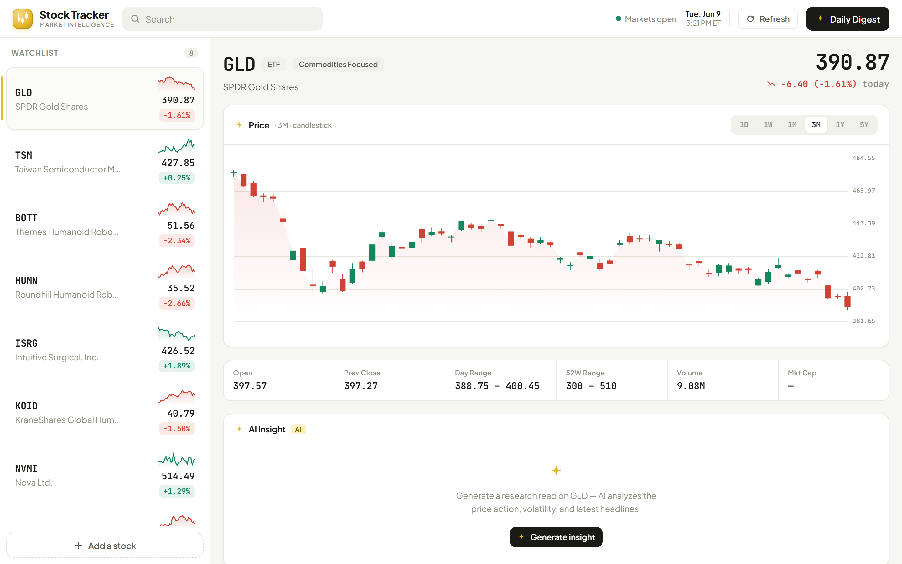
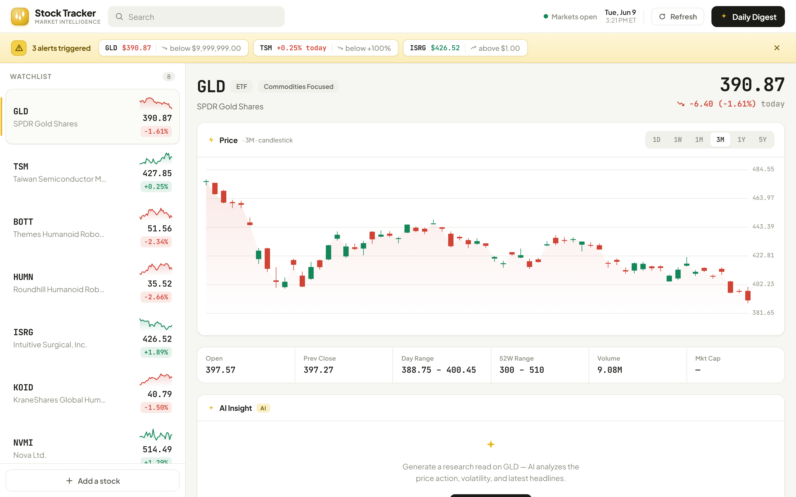

# Stock Tracker

A modern-fintech watchlist dashboard for tracking and monitoring specific stocks,
with AI-generated insights (per-stock research read, news summary, and a
whole-watchlist Daily Digest).

Default watchlist: `GLD, TSM, BOTT, HUMN, ISRG, KOID, NVMI, TSEM` — add/remove any
ticker; your watchlist, selection, and alerts persist in `localStorage`.

## Screenshots



_Watchlist rail with live prices and sparklines, a candlestick chart with multiple
timeframes, a stats strip, and the on-demand AI Insight panel._



_Saved alerts are checked against live data on open; triggered ones surface in a
banner up top (price or today's % change, including negative thresholds)._

## Architecture

- **`frontend/`** — static, no-build app (React + Babel Standalone from a CDN).
- **`main.py`** — FastAPI backend-for-frontend. Holds the OpenAI key server-side,
  proxies AI calls (`POST /api/complete`), and serves the `frontend/` directory.

The browser never sees the API key — it only ever calls `/api/complete` on our own
backend. Only `frontend/` is served statically, so `.env` and `main.py` are not
reachable over HTTP.

## Running

### Windows — start the app (every time)

You run the app from a terminal. `run.bat` (Command Prompt) and `run.ps1`
(PowerShell) both do the same thing and are safe to run every time: they set up
once on the first run, then just start the server.

**Command Prompt:**

1. Open Command Prompt (Windows key → type `cmd` → Enter).
2. Go to the project folder:
   ```cmd
   cd "C:\Users\nafer\github repo\Stock Tracker"
   ```
3. Start the app (wait for `Application startup complete`):
   ```cmd
   run.bat
   ```
4. Open your browser to <http://localhost:8000> (hard-refresh with `Ctrl+Shift+R`
   if you changed code).
5. Stop the app: click the terminal window and press `Ctrl+C`.

**PowerShell:** same as above, but in step 3 run `.\run.ps1` (in PowerShell,
`run.bat` alone won't run — use `.\run.bat` or `.\run.ps1`).

**First run only:** the script creates `.venv`, installs dependencies, and copies
`.env.example` to `.env`. Open `.env` and paste your `OPENAI_API_KEY` (the app runs
without it, but AI features fall back to local output until a key is set).

> **`'python' is not recognized`?** Plain Command Prompt can't find Python. Use the
> **Anaconda Prompt** instead (Windows key → `Anaconda Prompt`), then do steps 2–4.
> You do not need to activate any conda env — the script makes its own `.venv`.

> **`address already in use` / port 8000 busy?** A previous server is still running.
> Close that terminal window (or `Ctrl+C` it), then start again.

### Manual / non-Windows

```sh
python -m venv .venv
source .venv/bin/activate            # Windows: .venv\Scripts\activate
pip install -r requirements.txt
cp .env.example .env                  # then edit .env and paste your OPENAI_API_KEY
uvicorn main:app --reload --port 8000 # open http://localhost:8000
```

> Market data comes from the backend, so run via `uvicorn` (or the scripts above).
> A static-only server (`python -m http.server --directory frontend`) loads the UI
> but shows a "couldn't reach the market-data service" state — fine for CSS-only work.

## Layout

- **Topbar** — brand → search → market status + clock → Refresh / Daily Digest.
- **Alerts banner** — appears under the top bar when any saved alert is currently
  triggered, so you see it the moment you open the app. Click a chip to jump to that
  stock; dismiss to hide until the next refresh.
- **Watchlist rail** (left) — each row shows ticker, name, sparkline, price, and
  daily change pill. Click to open the detail view; **drag rows to reorder** the
  watchlist (the order persists). Reordering is disabled while a search filter is active.
- **Detail** (right) — header with price/change and risk-flag chip, a canvas
  candlestick chart (`1D/1W/1M/3M/1Y/5Y` + crosshair tooltip), a 6-stat strip, and
  stacked panels for **AI Insight**, **Recent News** (each headline opens the source
  article in a new tab), **Risk Monitor**, and **Price Alerts**.
- **Price Alerts** — `$` mode fires when the price crosses a value; `%` mode fires on
  **today's % change** crossing a value (negatives allowed, e.g. "below −2%" fires when
  the stock is down 2%+ on the day). Triggered alerts surface in the top banner.
- **Daily Digest** slide-over — synthesizes the whole watchlist into a morning brief.
- **Tweaks** panel — accent color, density, chart height, sparkline toggle.

## Files

| File | Purpose |
|------|---------|
| `main.py` | FastAPI backend — `/api/stocks`, `/api/complete`, `/api/health`, static serving. |
| `marketdata.py` | Real market data via yfinance (quotes, OHLC, stats, risk flags, news). |
| `requirements.txt` | Backend Python dependencies. |
| `.env.example` | Template for `OPENAI_API_KEY` and model config (copy to `.env`). |
| `frontend/index.html` | Entry point — fonts, CDN scripts, density rules. |
| `frontend/styles.css` | Design system + all component styles. |
| `frontend/data.jsx` | Market-data client — fetches `/api/stocks` + number formatting. |
| `frontend/chart.jsx` | Canvas candlestick chart + watchlist sparkline. |
| `frontend/ai.jsx` | AI calls (insight / news summary / digest), transport + local fallbacks. |
| `frontend/tweaks-panel.jsx` | Reusable Tweaks panel + form controls. |
| `frontend/app.jsx` | Main app — shell, watchlist, detail, AI panels, digest, modals. |

## AI & data

**Market data (`marketdata.py` → `/api/stocks`).** Real quotes, OHLC history (all
timeframes), stats (52w range, market cap, P/E, volume), risk flags, and headlines
come from **yfinance** (Yahoo Finance). Results are cached in-memory for 60s;
**Refresh** passes `fresh=1` to bypass the cache and pull the latest. There is no
mock data — fields Yahoo doesn't provide (e.g. an ETF's P/E) render as "—".

> yfinance is an unofficial Yahoo scraper — ideal for a demo, but it can rate-limit
> or change. Swap `marketdata.py` for a paid market-data API for production.

**AI transport (`frontend/ai.jsx`).** Each AI call tries, in order: the design host's
injected `complete()` → our `POST /api/complete` → a deterministic local fallback
(derived from the real price/news data). The AI Insight and news summary are **empty
until generated** — click **Generate insight** (or **Refresh**) to produce a live read;
nothing is pre-canned.

**When the AI actually runs (it costs money, so it's on-demand):**

- **Page load:** no AI. The 5–10s on first open is the live market-data fetch from
  Yahoo (8 tickers), not the model. Cached 60s afterward.
- **Refresh:** refetches market data (top-bar spinner), then generates a live insight +
  news summary for the *open* stock in the background (the Insight card shows its own
  shimmer). The spinner stops when the data is in; the card fills when the AI returns.
- **Daily Digest:** calls the model when you open it, then caches the result for that
  snapshot — reopening reuses it; a Refresh invalidates it.
- **Generate / Regenerate** buttons: one live call for that one stock.

**OpenAI (`main.py`).** Calls go through the **Responses API**. The news summary
sets `web_search: true`, which uses the hosted `web_search` tool with a
reasoning-capable model; AI Insight and the Daily Digest use the text model. Models
are env-configurable:

| Env var | Default | Used for |
|---------|---------|----------|
| `OPENAI_MODEL` | `gpt-5.4-nano-2026-03-17` | AI Insight, Daily Digest |
| `OPENAI_WEB_SEARCH_MODEL` | `gpt-5.5` | News summary (web search) |
| `OPENAI_SEARCH_CONTEXT_SIZE` | `low` | Web search depth |

> Confirm the exact model IDs against OpenAI's current model list — and that your
> chosen model supports the `web_search` tool — before relying on them.

AI output is labeled "Generated by AI · not investment advice."

### Possible next steps

- Add clickable source links to the news list (yfinance provides article URLs).
- Swap yfinance for a paid market-data API (e.g. Polygon, Twelve Data) for
  production reliability and rate limits.
- Add backend rate-limiting / a longer cache for AI responses to control cost.
